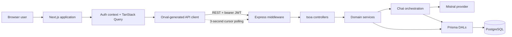

# BookWise AI

BookWise AI is a full-stack appointment-booking prototype built for the Full Stack Developer Technical Skills Assessment. It combines authenticated conversational booking, deterministic structured-form fallback, appointment management, conversation history, and near-real-time message polling.

## Submission links

- Source code: [github.com/ali-hamza-jutt/ai-appointment-booking](https://github.com/ali-hamza-jutt/ai-appointment-booking)
- Web application: [ai-appointment-booking-two.vercel.app](https://ai-appointment-booking-two.vercel.app)
- API documentation: [ai-appointment-booking-7yjg.onrender.com/docs](https://ai-appointment-booking-7yjg.onrender.com/docs)
- API health check: [ai-appointment-booking-7yjg.onrender.com/api/health](https://ai-appointment-booking-7yjg.onrender.com/api/health)

> **Sample-data warning:** `npm run db:deploy` applies only the database schema migrations. Sample records are not loaded automatically. After migrating, run `psql $env:DATABASE_URL -f prisma/sample-inserts.sql` from the `server` directory only for a local development or test database. Never run this command against production.

## Features

- Account signup and sign-in with short-lived JWT access tokens.
- AI-assisted appointment extraction using Mistral.
- Multi-turn booking conversations with persisted context and history.
- Structured booking form fallback when chat input is incomplete, ambiguous, or AI processing fails.
- Deterministic IANA-time-zone conversion with UTC storage.
- Explicit review and confirmation before an appointment is created.
- Duration-aware conflict detection that rejects overlapping appointments while allowing directly adjacent bookings.
- Appointment and conversation lists with cursor pagination.
- Three-second cursor-based polling for active conversation messages.
- One active booking conversation per user, with automatic resume and explicit abandonment when a new booking starts.
- Responsive UI with loading, error, retry, empty, disabled, and skeleton states.
- Swagger/OpenAPI documentation and Orval-generated frontend API hooks.

## Technology stack

| Area | Technology |
| --- | --- |
| Frontend | Next.js 16 App Router, React 19, TypeScript, Tailwind CSS 4 |
| Server state | TanStack Query |
| API client | Orval-generated React Query hooks with a custom Fetch mutator |
| Backend | Node.js, Express 5, TypeScript, tsoa |
| Database | PostgreSQL, Prisma 7, `@prisma/adapter-pg` |
| Authentication | JWT using `jose`, Argon2id password hashing |
| AI provider | Mistral Chat Completions API |
| Validation | tsoa request validation and Zod runtime validation |
| Logging | Pino and pino-http |
| API documentation | OpenAPI 3 and Swagger UI |

## High-level architecture



### Backend boundaries

The backend follows a controller/service/DAL structure:

1. **Middleware** handles request IDs, structured logging, security headers, CORS, rate limiting, JSON limits, authentication, and common errors.
2. **tsoa controllers** define the REST contract and translate authenticated HTTP requests into service calls.
3. **Services** own validation, normalization, response mapping, and domain rules.
4. **`ChatOrchestrationService`** coordinates chat persistence, AI extraction, structured form data, and appointment confirmation through narrow service ports.
5. **DAL classes** contain Prisma queries and explicit field projections.
6. **PostgreSQL constraints** protect uniqueness, relationships, and retry idempotency.

Controllers do not query Prisma directly, DALs do not contain HTTP logic, and the orchestration layer does not depend on AI-provider or database implementation details.

### Frontend boundaries

- App Router pages compose feature components and route-level loading/error states.
- Auth context manages the authenticated user and browser token lifecycle.
- TanStack Query manages server state, caching, mutations, pagination, and polling.
- Orval generates typed query hooks and models from the backend OpenAPI specification.
- Feature folders contain their components, hooks, types, constants, and formatting utilities.
- Shared UI components and CSS design tokens keep colors, typography, spacing, and interaction states consistent.

## Booking workflow

1. The user signs up or signs in and receives a bearer access token.
2. The booking workspace automatically retrieves and resumes the user's single active chat without displaying a selection dialog.
3. If no active chat exists, the frontend creates one when the first booking message is sent.
4. Selecting **New booking** atomically marks the current chat `ABANDONED` and creates its `ACTIVE` replacement. Abandoned chats remain read-only in conversation history.
5. Each user message includes a frontend-generated `clientMessageId` and browser IANA time zone.
6. The backend stores the user message once and checks for an existing assistant reply during retries.
7. Mistral extracts the service, local date, local time, duration, and notes from conversational input.
8. The backend validates the AI JSON and converts local wall-clock values to a UTC instant.
9. If details are incomplete or AI processing fails, the user can enter them in a structured form. Structured values are validated by the server and bypass Mistral.
10. The evolving booking context and assistant response are persisted on the chat session.
11. Active clients poll from the latest message cursor every three seconds and merge only newly received messages.
12. The user reviews the final details and confirms the booking.
13. During confirmation, the backend locks that user's appointment schedule and rejects any overlapping time range.
14. If the slot is available, one atomic database write closes the chat, creates the appointment, and stores the success message.

## Repository structure

```text
.
|-- server/
|   |-- prisma/
|   |   |-- migrations/          PostgreSQL DDL migrations
|   |   |-- schema.prisma        Relational application model
|   |   |-- PERFORMANCE.md       Index and query design notes
|   |   `-- sample-inserts.sql   Development-only sample data
|   |-- src/
|   |   |-- config/              Validated environment and logger
|   |   |-- constants/           Shared backend constants and messages
|   |   |-- infrastructure/      Prisma and PostgreSQL connection
|   |   |-- integrations/ai/     AI service, prompt, provider, DTOs, errors
|   |   |-- middleware/           Authentication, logging, limits, errors
|   |   |-- modules/              Auth, appointments, chat, and health
|   |   `-- utils/                Shared validation, JWT, time, and pagination
|   `-- README.md                 Backend-specific operational notes
|-- web/
|   |-- src/
|   |   |-- app/                  Next.js routes and layouts
|   |   |-- components/           Shared UI, brand, and layout components
|   |   |-- features/             Auth, booking, appointments, conversations
|   |   |-- generated/api/        Orval-generated API hooks and models
|   |   |-- hooks/                Cross-feature browser hooks
|   |   |-- lib/                  API, auth, config, and utility layers
|   |   `-- providers/            Application providers
|   `-- orval.config.ts           OpenAPI client generation configuration
|-- .gitignore
|-- LICENSE
`-- README.md
```

## Local development

### Prerequisites

- Node.js 22 or newer
- npm
- PostgreSQL database, local or hosted
- Mistral API key for conversational AI extraction

### 1. Clone the repository

```bash
git clone https://github.com/ali-hamza-jutt/ai-appointment-booking.git
cd ai-appointment-booking
```

### 2. Configure and start the backend

```bash
cd server
cp .env.example .env
npm ci
npm run db:deploy
npm run dev
```

Update `server/.env` before applying migrations. At minimum, provide a valid `DATABASE_URL`, a random `JWT_SECRET` containing at least 32 characters, and a `MISTRAL_API_KEY` for the conversational flow.

The backend runs at `http://localhost:4000` by default:

- Swagger UI: [http://localhost:4000/docs](http://localhost:4000/docs)
- Health check: [http://localhost:4000/api/health](http://localhost:4000/api/health)

Use `npm run db:migrate` only when creating a new development migration. Use `npm run db:deploy` to apply the migrations already committed to the repository.

### 3. Configure and start the frontend

Open another terminal:

```bash
cd web
cp .env.example .env.local
npm ci
npm run dev
```

The frontend runs at [http://localhost:3000](http://localhost:3000). Its API base URL defaults to `http://localhost:4000/api`.

On Windows PowerShell, use `Copy-Item .env.example .env` for the server and `Copy-Item .env.example .env.local` for the frontend instead of `cp`.

## Environment configuration

Never commit `.env` files or real credentials. The repository tracks only safe `.env.example` templates.

### Backend variables

| Variable | Purpose |
| --- | --- |
| `NODE_ENV` | Runtime mode: `development`, `test`, or `production` |
| `PORT` | Express HTTP port; deployment platforms can inject it |
| `WEB_ORIGIN` | Exact allowed frontend origin for CORS |
| `LOG_LEVEL` | Pino log level |
| `DATABASE_URL` | PostgreSQL connection string |
| `JWT_SECRET` | JWT signing secret with at least 32 characters |
| `JWT_ISSUER` | Expected token issuer |
| `JWT_AUDIENCE` | Expected token audience |
| `JWT_ACCESS_TOKEN_TTL_SECONDS` | Access-token lifetime in seconds |
| `MISTRAL_API_KEY` | Mistral credential used for conversational extraction |
| `MISTRAL_MODEL` | Mistral model identifier |
| `MISTRAL_API_URL` | Mistral API base URL |
| `AI_REQUEST_TIMEOUT_MS` | Maximum duration of one provider request |
| `AI_MAX_HISTORY_MESSAGES` | Maximum recent conversation turns sent to Mistral |

### Frontend variable

| Variable | Purpose |
| --- | --- |
| `NEXT_PUBLIC_API_BASE_URL` | Public backend URL including the `/api` base path |

## API overview

All domain routes except signup, sign-in, and health require `Authorization: Bearer <token>`.

| Method | Route | Purpose |
| --- | --- | --- |
| `POST` | `/api/auth/signup` | Create an account and issue a JWT |
| `POST` | `/api/auth/sign-in` | Authenticate and issue a JWT |
| `GET` | `/api/auth/me` | Return the currently authenticated user |
| `POST` | `/api/appointments` | Create a form-sourced appointment |
| `GET` | `/api/appointments` | List owned appointments with cursor pagination |
| `GET` | `/api/appointments/{appointmentId}` | Retrieve one owned appointment |
| `POST` | `/api/chat/sessions` | Return the active conversation or abandon and replace it when `replaceActive` is true |
| `GET` | `/api/chat/sessions` | List owned conversations |
| `GET` | `/api/chat/sessions/{sessionId}` | Retrieve one owned conversation |
| `POST` | `/api/chat/sessions/{sessionId}/messages` | Process conversational or structured booking details |
| `GET` | `/api/chat/sessions/{sessionId}/messages` | Load history or poll after a message cursor |
| `POST` | `/api/chat/sessions/{sessionId}/confirm` | Atomically create the chat appointment |
| `GET` | `/api/health` | Report process availability |

The complete request and response schemas are available in Swagger UI. tsoa rejects unexpected body properties and produces consistent validation errors.

## API client generation

The backend controllers and DTOs are the API contract source. After changing that contract, regenerate the frontend client:

```bash
cd web
npm run api:generate
```

This command creates the OpenAPI specification and runs Orval. Files under `web/src/generated/api` are generated and must not be edited manually.

## Database design

The PostgreSQL DDL is represented by committed SQL migrations under `server/prisma/migrations`.

| Table | Responsibility |
| --- | --- |
| `users` | Authentication identity and profile fields |
| `appointments` | Scheduling data, source, status, and optional chat relation |
| `chat_sessions` | Conversation ownership, lifecycle, and JSONB booking context |
| `chat_messages` | Ordered user, assistant, and system messages with metadata |

Important database decisions include:

- UUID primary keys are generated automatically.
- Email uniqueness supports registration and sign-in lookup.
- Foreign keys enforce ownership relationships and cascade appropriate deletions.
- Duration-aware checks inside serialized per-user transactions prevent overlapping appointment writes; exact-start uniqueness remains a database fallback.
- A PostgreSQL partial unique index permits only one `ACTIVE` chat session per user.
- Client-message and reply constraints make retries idempotent.
- Composite indexes support owned appointment, session, and message pagination.
- JSONB is limited to evolving booking context and structured AI metadata; searchable scheduling fields remain typed relational columns.

Detailed index and query notes are in [`server/prisma/PERFORMANCE.md`](server/prisma/PERFORMANCE.md).

### Sample inserts

[`server/prisma/sample-inserts.sql`](server/prisma/sample-inserts.sql) contains development-only examples for all four tables and demonstrates their relationships. The sample login is `demo@bookwise.local` with password `BookWise123`.

Do not run the sample file against production. To load it into an expendable development database after migrations:

```bash
psql "<development-database-url>" -f server/prisma/sample-inserts.sql
```

## AI integration and guardrails

- Mistral is isolated behind an AI provider interface.
- The system prompt requests one strict JSON object rather than free-form booking data.
- Provider responses and appointment context are runtime-validated with Zod.
- Only a bounded recent-message window is sent to the provider.
- Previous conversation context is labeled untrusted so stored text is not treated as system instructions.
- The backend, not the model, converts local date/time values into UTC.
- Invalid, past, nonexistent, or ambiguous local times are rejected.
- Structured form submissions bypass Mistral and use normal domain validation.
- Provider timeouts, network failures, invalid responses, and unavailable configuration map to explicit API errors.
- Operational logs contain provider, model, latency, token usage, finish reason, and error category without logging credentials or conversation content.
- No database transaction remains open while waiting for an external AI response.

## Security, reliability, and performance

- Argon2id password hashing with a dummy-hash verification path reduces email-enumeration timing differences.
- HS256 JWTs validate signature, issuer, audience, subject, and expiration.
- Helmet, CORS allowlisting, body-size limits, request IDs, and centralized errors are enabled.
- Authentication and AI-backed routes use separate rate limits.
- DAL queries include the authenticated user ID, combining ownership enforcement and retrieval.
- Prisma queries use explicit `select` projections; password hashes never appear in API responses.
- Cursor pagination avoids increasingly expensive large offsets.
- Polling requests begin from the latest cursor instead of downloading full message history.
- AI history is bounded and database queries retrieve only required fields.
- Starting a new booking abandons the current active chat and creates its replacement in one transaction.
- Form creation and chat confirmation use the same transaction-safe appointment overlap rule.
- Booking confirmation closes the session, creates the appointment, and stores the success message atomically.
- Graceful shutdown closes the HTTP listener and PostgreSQL connection.

## Key decisions and tradeoffs

| Decision | Reason | Tradeoff |
| --- | --- | --- |
| REST with three-second polling | Simple near-real-time behavior that works with the existing API and free hosting | More requests and slightly higher latency than WebSockets |
| tsoa as the API contract | Generates validation, routes, and OpenAPI from typed controllers | Generated artifacts must be refreshed after contract changes |
| Orval frontend generation | Keeps frontend hooks and response models synchronized with OpenAPI | Generated files add repository volume and are not hand-edited |
| Prisma with DAL classes | Provides typed queries while keeping persistence outside business services | Adds an explicit mapping layer |
| Cursor pagination | Stable and efficient for growing histories | Cursors are opaque and do not support arbitrary page jumps |
| UTC storage plus IANA conversion | Preserves exact instants while displaying the user's local time | DST gaps and folds require explicit rejection |
| JSONB for AI context only | Allows metadata to evolve without weakening the relational schedule model | JSON fields have fewer compile-time database guarantees |
| Browser-stored bearer token | Keeps the prototype stateless and straightforward | Production would prefer secure HttpOnly cookies plus refresh/revocation controls |
| In-memory rate limiting | Appropriate for one prototype server instance | Multiple instances require a shared store such as Redis |
| Structured form bypasses AI | Provides a reliable fallback for incomplete or failed conversations | Two input paths must converge on the same domain validation |
| Single active booking chat | Automatically restores the current draft and prevents competing booking contexts | Starting a new booking permanently abandons the previous active chat |

## Assumptions

- Each account represents one appointment owner; provider/resource scheduling is outside this prototype.
- The browser supplies a valid IANA time zone and the user reviews displayed details before confirmation.
- A chat session produces at most one appointment.
- Each user has at most one active chat; abandoned chats are retained as read-only history and cannot be resumed.
- Duration defaults to 30 minutes when it is not supplied.
- Optional notes do not block booking confirmation.
- Overlapping appointment time ranges for one user are conflicts; directly adjacent appointments remain valid.
- PostgreSQL and the Mistral API are reachable from the deployed backend.

## Known limitations

- There is no provider availability, calendar synchronization, cancellation, rescheduling, or reminder workflow.
- The data model does not include optional multi-tenancy through a `business_id`.
- Polling is near-real-time rather than a WebSocket connection.
- JWT access tokens are not refreshed, revoked, or stored in HttpOnly cookies.
- Rate limiting uses process memory and is not shared across multiple server instances.
- The health endpoint checks process availability but not database readiness.
- Mistral requests are not automatically retried; safe client retries rely on message idempotency.
- The prototype has no automated test suite; linting, strict type checks, production builds, and manual workflow verification are used currently.
- Free backend hosting can introduce cold-start delays after inactivity.

## Verification commands

Run these before submitting or deploying:

```bash
cd server
npm run lint
npm run typecheck
npm run db:validate
npm run build
```

```bash
cd web
npm run lint
npx tsc --noEmit
npm run build
```

Recommended manual verification:

1. Sign up, sign out, and sign in.
2. Confirm that protected pages redirect unauthenticated users.
3. Start a chat, leave the booking workspace, and confirm that returning automatically restores it without a selection dialog.
4. Select **New booking** and verify the previous chat becomes read-only and `ABANDONED` while the replacement is the only active chat.
5. Start an incomplete chat request and complete it through the structured form.
6. Create a conversational booking and correct its service or time before confirmation.
7. Confirm that the stored appointment displays in the browser time zone.
8. Retry a failed message and confirm it is not duplicated.
9. Open the same active conversation in another tab and verify polling receives new messages.
10. Confirm the appointment, then review appointment and conversation history.
11. Create a 30-minute appointment, verify an overlapping booking returns a conflict, and verify a booking starting exactly at its end time succeeds.
12. Verify one user cannot access another user's resource IDs.

## Deployment

### Backend on Render

Create a Node web service with:

- Root directory: `server`
- Build command: `npm ci --include=dev && npm run build`
- Start command: `npm start`
- Health check path: `/api/health`

Configure the backend environment variables from `server/.env.example`. Set `WEB_ORIGIN` to the exact Vercel origin without a trailing slash. Render supplies `PORT`; it does not need to be set manually.

Apply committed database migrations to the hosted PostgreSQL database with:

```bash
npm run db:deploy
```

### Frontend on Vercel

Import the same repository with `web` as the root directory. Set:

```env
NEXT_PUBLIC_API_BASE_URL=https://ai-appointment-booking-7yjg.onrender.com/api
```

Set Render's `WEB_ORIGIN` to `https://ai-appointment-booking-two.vercel.app` and redeploy the backend whenever that value changes.

## License

This project is licensed under the [MIT License](LICENSE).
